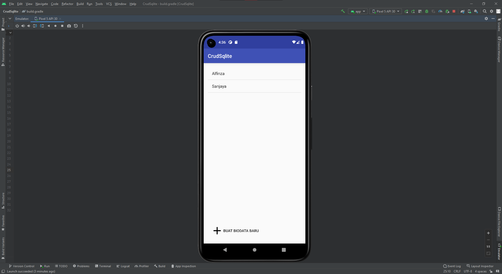
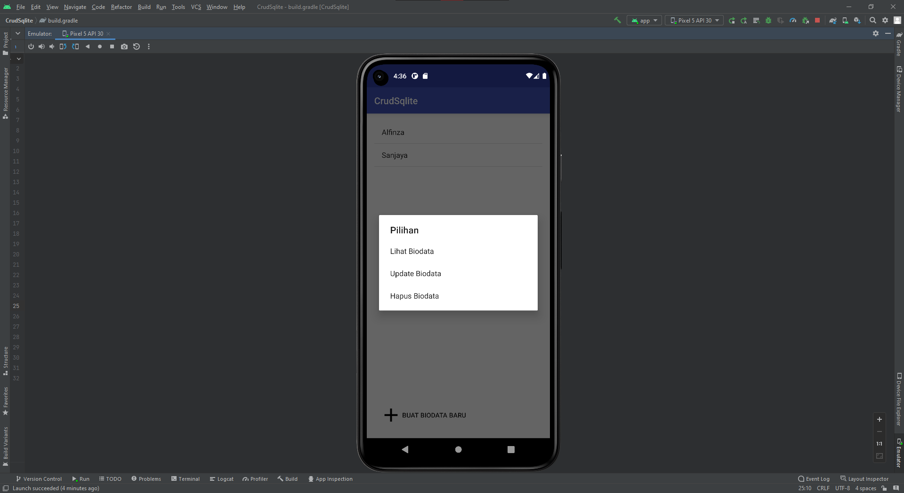
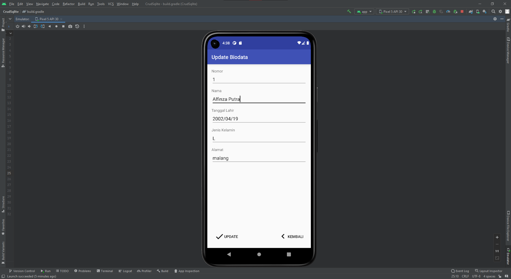
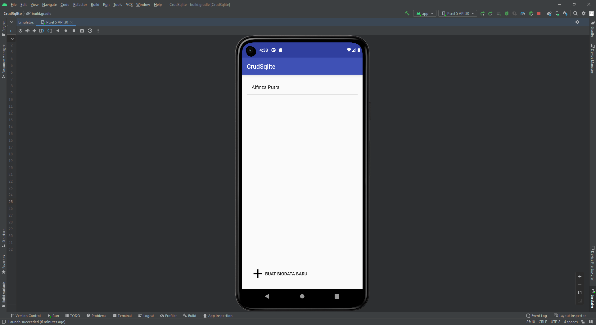

## Nama      : Alfinza Sanjaya Putra
## Kelas     : TI - 3C
## No. Absen : 02

Tugas Praktikum : 
- Buat project baru berdasarkan code CRUD Sqlite tsb.
- Kumpulkan ke GitHub dg nama repo: sqlite-android-java
- Kumpulkan link repo tsb ke LMS

Tampilan Awal

Tambah Data Baru

Berhasil Tambah Data

Pilihan Lihat, Update, dan Delete Data

Lihat Data

Update Data

Delete Data 

